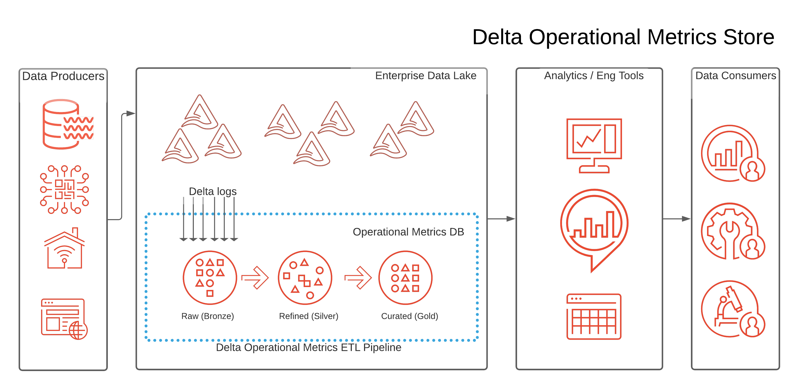

# Delta Operational Metrics Store (DeltaOMS)
Delta Operational Metrics Store (DeltaOMS) is a solution that helps to build a 
centralized repository of operational metrics/statistics for your [Lakehouse](http://cidrdb.org/cidr2021/papers/cidr2021_paper17.pdf) 
built on [Delta Lake](https://github.com/delta-io/delta) 

## Project Overview
DeltaOMS provides a solution for automatically collecting operational metrics/statistics from Delta 
Lakehouse tables into a separate centralized database. This will enable you to gain centralized access 
to the operational metrics for your data in near real-time. This centralized data can be utilized
to gain helpful operational insights, setting up monitoring/alerting and observability for your 
Delta Lakehouse ETL Pipelines. It could also help you to identify trends based on data characteristics, 
improve ETL pipeline performance, provide capabilities for auditing and traceability of your Delta Lake data etc.

Few examples of how you could use the centralized operational metrics/statistics collated by DeltaOMS :

- What are the most frequent WRITE operations across my data lakehouse ?
- How many WRITE operations were run on my Data Lakehouse in the last hour ?
- Which are the top WRITE heavy databases in my data lakehouse ?
- Track File I/O ( bytes written, number of writes etc.) across my entire data lakehouse
- Tracking growth of data size, commit frequency etc. over time for tables/databases
- Did the delete operations for GDPR compliance go through and what changes it made to the filesystem ?

## How does DeltaOMS work
DeltaOMS subscribes to the delta logs of the configured databases/tables and pulls all the 
[operational metrics](https://docs.databricks.com/delta/delta-utility.html#operation-metrics-keys) 
written out during Delta table writes. These metrics are enriched with additional information 
( like path, file name, commit timestamp etc.), processed to build snapshots over time and 
persisted into different tables as actions and commit information. Refer to the 
[Delta Transaction Log Protocol](https://github.com/delta-io/delta/blob/master/PROTOCOL.md#actions) 
for more details on Actions and CommitInfo.

## High-Level Process Flow:

## How is the DeltaOMS executed
DeltaOMS provides a jar and sample notebooks to help you setup , configure and 
create the required databases, tables and Databricks Jobs.These notebooks and jobs run on 
your environment to create a centralized operational metrics database, capture metrics and 
make it available for analytics.

## How much does it cost ?
DeltaOMS does not have any **direct cost** associated with it other than the cost to run the jobs 
on your environment.The overall cost will be determined primarily by the number of Delta Lakehouse 
objects tracked and frequency of the OMS data refresh. 
We have found that the additional insights gained from DeltaOMS helps reduce the total cost of 
ownership through better management and optimization of your data pipelines while providing much 
improved view on the operational metrics and statistics for the Delta Lakehouse.

## More questions

Refer to the [FAQ](https://databrickslabs.github.io/delta-oms/faq/) 
and [Developer Guide](https://databrickslabs.github.io/delta-oms/developer_guide/) for the 
DeltaOMS [documentation](https://databrickslabs.github.io/delta-oms/)

## Getting Started

Refer to the  [Getting Started](https://databrickslabs.github.io/delta-oms/getting_started/) guide

## Building the Project
DeltaOMS uses `sbt` as the build tool. Following are the high level building steps:

- `git clone` the repo to a local directory
- Execute `sbt clean compile test` to compile and test the code
- Build the jar using `sbt clean compile assembly`
- Refer to the [build.sbt](./build.sbt) for library dependencies

## Deploying / Installing / Using the Project
The DeltaOMS solution is available through Maven. You can get the release jar using the following maven
co-ordinates : `"com.databricks.labs" % "delta-oms_2.12" % "0.x.0"`

Please follow the [Getting Started](https://databrickslabs.github.io/delta-oms/getting_started/) guide for instructions on 
using DeltaOMS on Databricks environment.

## Releasing the Project
DeltaOMS is released as a `jar` and `notebooks` for setting up Databricks jobs. 
It also provides few sample notebooks for typical analysis.
Refer to the [Getting Started](https://databrickslabs.github.io/delta-oms/getting_started/) guide for more details.

## Project Support
Please note that all projects in the /databrickslabs github account are provided for your 
exploration only, and are not formally supported by Databricks with Service Level Agreements (SLAs).
They are provided AS-IS and we do not make any guarantees of any kind.
Please do not submit a support ticket relating to any issues arising from the use of these projects.

Any issues discovered through the use of this project should be filed as GitHub Issues on the Repo.
They will be reviewed as time permits, but there are no formal SLAs for support.

# Contributing 
We welcome contributions to DeltaOMS. See our [CONTRIBUTING.md](CONTRIBUTING.md) for more details.

# License
See [LICENSE](LICENSE).
