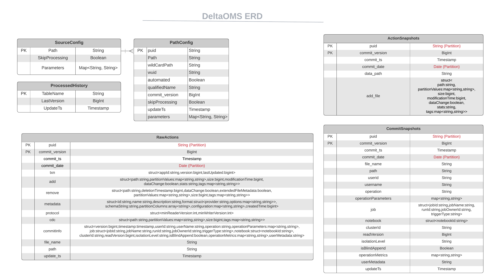

# DeltaOMS - Developer Guide

DeltaOMS provides "Automated Observability" for Delta Lakehouse objects. This developer guide 
assumes you have already completed the tutorial from the 
[Getting Started Guide](./GETTING%20STARTED.md).

Once you have completed the getting started , this guide will help with understanding 
inner workings of DeltaOMS


## Configuration Tables

### Source Config

Default Name :  `sourceconfig`

Table used for adding databases/paths/individual table to be tracked by DeltaOMS

| Column | Type | Description | 
| :-----------: | :----------- | ----------- | 
| path     | String | Path to the Delta object to be tracked by DeltaOMS. <br> Could be a database (all tables will be included), directory, individual table or specific path |
| skipProcessing | Boolean | Flag to exclude processing a row |
| parameters | Map<String,String> | Placeholder for dynamic parameters to be passed to DeltaOMS (supports easy future expansion). <br><br> Currently , the only required parameter is `wildCardLevel` |

Typical usage for adding input source configuration :
```$sql
-- Adding a Database. OMS will discover all Delta tables in the database. 
-- ConfigurePaths process could take longer depending on number of tables in the database.
INSERT INTO <OMSDBNAME>.sourceconfig values('<databaseName>', false, Map('wildCardLevel','0'))

-- Adding an entire directory. OMS will discover all Delta tables underneath the directory recursively. 
-- The `**` is required after the directory name. 
-- ConfigurePaths process could take longer depending on number of nested delta paths under the directory.
INSERT INTO <OMSDBNAME>.sourceconfig values('<dirName/**>', false, Map('wildCardLevel','0'))

-- Adding a table
INSERT INTO <OMSDBNAME>.sourceconfig values('<fully qualified table name>', false, Map('wildCardLevel','0'))

-- Adding an individual table path
INSERT INTO <OMSDBNAME>.sourceconfig values('<Full table path on storage>', false, Map('wildCardLevel','0'))
```

#### WildCard Level Configuration

The wildcard level setting for a path determines how the path is modified into a wildcard path 
internally and used by DeltaOMS during ingestion.

| Param Value |  Description | Example |
| :-----------: | :----------- | ------ |
| `Map('wildCardLevel','0')` | Tracks all tables in a database path | `dbfs:/user/hive/warehouse/sample.db/table1` -> `dbfs:/user/hive/warehouse/sample.db/*/_delta_log/*.json` |
| `Map('wildCardLevel','1')` | Tracks multiple database under a path | `dbfs:/user/hive/warehouse/sample.db/table1` -> `dbfs:/user/hive/warehouse/*/*/_delta_log/*.json` |
| `Map('wildCardLevel','-1')` | Tracks only the individual path | `dbfs:/user/hive/warehouse/sample.db/table1` -> `dbfs:/user/hive/warehouse/sample.db/table1/_delta_log/*.json` |

### Path Config

Default Name :  `pathconfig`

Internal table that maintains the configuration for each individual Delta table path. 
This is populated by executing the `com.databricks.labs.deltaoms.init.ConfigurePaths.main` process

| Column | Type | Description | 
| :-----------: | :----------- | ----------- | 
| path     | String | Path to a individual Delta table to be tracked by DeltaOMS |
| puid | String | Unique identifier for the table `path` . Used for partitioning of data inside DeltaOMS |
| wildCardPath | String | Wildcard path representation from the individual table `path` . Used for generating optimized read streams. <br> Behaviour controlled through the `wildCardLevel` parameter |
| wuid | String | Unique identifier for wildcard `path`. Used for uniquely identifying the streams |
| qualifiedName | String | Fully Qualified name of a table (if defined in the metastore). For tables not defined in metastore, defaults to the table path  |
| parameters | Map<String,String> | Placeholder for dynamic parameters to be passed to DeltaOMS (supports easy future expansion). <br><br> Currently , the only required parameter is `wildCardLevel` |

### Processed History

Default Name : `processedhistory`

Internal tracking table for last version of Delta `action`s processed by DeltaOMS. Populated during OMS data processing

| Column | Type | Description | 
| :-----------: | :----------- | ----------- | 
| tableName     | String | Table name tracked by DeltaOMS. Eg. - `rawactions` |
| lastVersion     | Long | Last Version of Actions processed by DeltaOMS |
| update_ts     | Timestamp | Last update timestamp |

## Data Tables

### Raw Actions

Default Name : `rawactions`

Stores the raw actions captured through the ingestion of the `_delta_log` json files for all tracked tables. 
The schema has the columns matching the Actions from here(https://github.com/delta-io/delta/blob/master/core/src/main/scala/org/apache/spark/sql/delta/actions/actions.scala#L515) 
and the [Delta Log Protocol](https://github.com/delta-io/delta/blob/master/PROTOCOL.md#actions) with 
the following additional fields :

| Column | Type | Description | 
| :-----------: | :----------- | ----------- | 
| file_name     | String | Name of the Delta log transaction `json` file. <br> Eg. - `dbfs:/user/hive/warehouse/sample.db/table1/_delta_log/00000000000000000025.json` |
| path     | String | Path to the Delta table. Eg. - `dbfs:/user/hive/warehouse/sample.db/table1` |
| puid     | String | Path Unique Identifier (Partition column)|
| commit_version     | Long | Transaction Commit Version of the data. Eg. - `25` |
| commit_ts     | Timestamp | Transaction Commit Timestamp. Eg. - `2021-06-16T18:08:20.000+0000` |
| update_ts     | Timestamp | Last update timestamp |
| commit_date     | Date | Transaction Commit Date (Partition column) |

### Commit Info Snapshots

Default Name : `commitinfosnapshots`

DeltaOMS processes the raw actions from the Delta logs and creates a separate table for the [Commit Information](https://github.com/delta-io/delta/blob/master/PROTOCOL.md#commit-provenance-information)
The schema matches the [history schema](https://docs.databricks.com/delta/delta-utility.html#history-schema) with the following additional columns:

| Column | Type | Description | 
| :-----------: | :----------- | ----------- | 
| file_name     | String | Name of the Delta log transaction `json` file. <br> Eg. - `dbfs:/user/hive/warehouse/sample.db/table1/_delta_log/00000000000000000025.json` |
| path     | String | Path to the Delta table. Eg. - `dbfs:/user/hive/warehouse/sample.db/table1` |
| puid     | String | Path Unique Identifier (Partition column)|
| commit_version     | Long | Transaction Commit Version of the data. Eg. - `25` |
| commit_ts     | Timestamp | Transaction Commit Timestamp. Eg. - `2021-06-16T18:08:20.000+0000` |
| update_ts     | Timestamp | Last update timestamp |
| commit_date     | Date | Transaction Commit Date (Partition column) |
 
### Action Snapshots

Default Name : `actionsnapshots`

DeltaOMS ingests all the actions from the tracked delta transaction logs. During processing, DeltaOMS extracts
the [Add/Remove actions](https://github.com/delta-io/delta/blob/master/PROTOCOL.md#add-file-and-remove-file), 
reconciles the AddFile and RemoveFile actions to build the snapshots at each `commit_version` for a 
table/path and populates the action snapshots table.

This table provides the ability to query file snapshots for any tracked delta path at certain 
point in time / commit version and get the data file details.

| Column | Type | Description | 
| :-----------: | :----------- | ----------- | 
| data_path     | String | Path to the Delta table. Eg. - `dbfs:/user/hive/warehouse/sample.db/table1` |
| puid     | String | Path Unique Identifier (Partition column)|
| commit_version     | Long | Transaction Commit Version of the data. Eg. - `25` |
| commit_ts     | Timestamp | Transaction Commit Timestamp. Eg. - `2021-06-16T18:08:20.000+0000` |
| commit_date     | Date | Transaction Commit Date (Partition column) | 
| add_file | Struct | [AddFile](https://github.com/delta-io/delta/blob/master/PROTOCOL.md#add-file-and-remove-file) |

## Data Model



# Key Components

### Initialization

DeltaOMS provides the component `com.databricks.labs.deltaoms.init.InitializeOMS` for initializing  
the centralized OMS database. The component creates the OMS DB at the location specified by the configuration settings.
Note: This process will delete all existing data in the specified location.

| Configuration Key | Command Line Argument | Description | Required | Example | Default Value |
| :-----------: | :----------- | ----------- | ----------- | ----------- | ----------- |
| base-location   |  --baseLocation= | Base location/path of the OMS Database on the Delta Lake  | Y | dbfs:/spark-warehouse/oms.db | None |
| db-name   | --dbName= | OMS Database Name. This is the database where all the Delta log details will be collected | Y | oms.db | None |
| raw-action-table  | None | OMS table name for storing the raw delta logs collected from the configured tables | N | oms_raw_actions | rawactions |
| source-config-table  | None | Configuration table name for setting the list of Delta Path, databases and/or tables for which the delta logs should be collected by OMS | N | oms_source_config | sourceconfig |
| path-config-table   | None | Configuration table name for storing Delta path details and few related metadata for internal processing purposes by OMS | N | oms_path_config | pathconfig |
| processed-history-table  | None | Configuration table name for storing processing details for OMS ETL Pipelines. Used internally by OMS | N | oms_processed_history | processedhistory |
| commit-info-snapshot-table  | None | Table name for storing the Delta Commit Information generated from the processed raw Delta logs for configured tables/paths | N | oms_commitinfo_snapshots | commitinfosnapshots |
| action-snapshot-table  | None | Table name for storing the Delta Actions information snapshots. Generated from processing the Raw Delta logs | N | oms_action_snapshots | actionsnapshots |

### Configuration

Once DeltaOMS has been initialized, and the input sources configured [Source Config](#source-config), 
the component provided by `com.databricks.labs.deltaoms.init.ConfigurePaths` is executed to 
populate the internal [path config](#path-config) tables. This component is also responsible for 
discovering delta tables under a database or under a directory (based on how the source is configured).

| Configuration Key | Command Line Argument | Description | Required | Example | Default Value |
| :-----------: | :----------- | ----------- | ----------- | ----------- | ----------- |
| base-location   |  --baseLocation= | Base location/path of the OMS Database on the Delta Lake  | Y | dbfs:/spark-warehouse/oms.db | None |
| db-name   | --dbName= | OMS Database Name. This is the database where all the Delta log details will be collected | Y | oms.db | None |
| skip-initialize-oms | --skipInitializeOMS | Skip initializing DeltaOMS DB  | N | true | false |

This component should be executed whenever there are updates to the source config table.

### Ingestion

DeltaOMS uses the delta log json files as its input. Details of the Delta Protocol Json files 
can be found [here](https://github.com/delta-io/delta/blob/master/PROTOCOL.md#file-types) 

Based on the databases, tables or individual path configured in DeltaOMS, it will fetch the 
json files under the `_delta_log` folder as streams. To prevent creation of multiple streams 
(applicable for large number of databases and streams) , the number of streams are optimized by 
creating streams on wildcard paths instead of individual paths for table(s).

For example, if a tracked table has the path as
`dbfs:/user/hive/warehouse/sample.db/table1`, DeltaOMS uses the path 
`dbfs:/user/hive/warehouse/sample.db/*/_delta_log/*.json` to read the Delta logs.

The benefits of this approach are :
- Automatically supports any additional table added to the database
- No additional streams needs to be created for each additional table, making the solution more scalable

For ways to configure the wildcard behaviour , refer to [Source Config](#source-config)

During ingestion, DeltaOMS reads the list of `wildcardpath`s from the `pathconfig` table and 
creates separate read streams for each path. OMS also maintains separate checkpoint location, pool 
and queryname for each stream. The Delta log json files are read, enriched with additional fields 
and persisted to the `rawactions` table.

The ingestion process is executed from the `com.databricks.labs.deltaoms.ingest.StreamPopulateOMS` 
object. By default, each streaming ingestion job can support upto 50 streams. If more than 50 
streams ( for example more than 50 distinct wildcard paths) would be involved , we recommend 
creating separate Databricks jobs. The `com.databricks.labs.deltaoms.ingest.StreamPopulateOMS` 
supports command line parameters `--startingStream` and `--endingStream` for setting the 
number of streams in each job.By default, these are set to 1 and 50 respectively.

| Configuration Key | Command Line Argument | Description | Required | Example | Default Value |
| :-----------: | :----------- | ----------- | ----------- | ----------- | ----------- |
| base-location   |  --baseLocation= | Base location/path of the OMS Database on the Delta Lake  | Y | dbfs:/spark-warehouse/oms.db | None |
| db-name   | --dbName= | OMS Database Name. This is the database where all the Delta log details will be collected | Y | oms.db | None |
| checkpoint-base   | --checkpointBase= | Base path for the checkpoints for OMS streaming pipeline for collecting the Delta logs for the configured tables | Y | dbfs:/_oms_checkpoints/ | None |
| checkpoint-suffix  | --checkpointSuffix= | Suffix to be added to the checkpoint path. Useful during testing for starting off a fresh process | Y | _1234 | None |
| trigger-interval  | None | Trigger interval for processing the Delta logs from the configured tables/paths  | N | 30s | Once |
| starting-stream | --startingStream= | Starting stream number for the Ingestion Job | N | 10 | 1 |
| ending-stream | --endingStream= | Ending stream number for the Ingestion Job | N | 30 | 50 |
| skip-path-config | --skipPathConfig | Skip updating the Path Config table from the latest Source config  | N | true | false |
| skip-initialize-oms | --skipInitializeOMS | Skip initializing DeltaOMS DB  | N | true | false |


### Processing

DeltaOMS processes the ingested data from `rawactions` and creates enriched / reconciled tables 
for Commit Info and Snapshots.

The `com.databricks.labs.deltaoms.process.OMSProcessRawActions` object looks for the newly added 
raw actions by utilizing the 
[Change Data Feed feature](https://docs.databricks.com/delta/delta-change-data-feed.html). 
The new actions are reconciled to get a list of data files conforming to 
 [AddFile](https://github.com/delta-io/delta/blob/master/PROTOCOL.md#add-file-and-remove-file)
and [CommitInfo](https://github.com/delta-io/delta/blob/master/PROTOCOL.md#commit-provenance-information). 
These are then persisted into Action Snapshots and Commit Info Snapshots respectively. 

| Configuration Key | Command Line Argument | Description | Required | Example | Default Value |
| :-----------: | :----------- | ----------- | ----------- | ----------- | ----------- |
| base-location   |  --baseLocation= | Base location/path of the OMS Database on the Delta Lake  | Y | dbfs:/spark-warehouse/oms.db | None |
| db-name   | --dbName= | OMS Database Name. This is the database where all the Delta log details will be collected | Y | oms.db | None |


