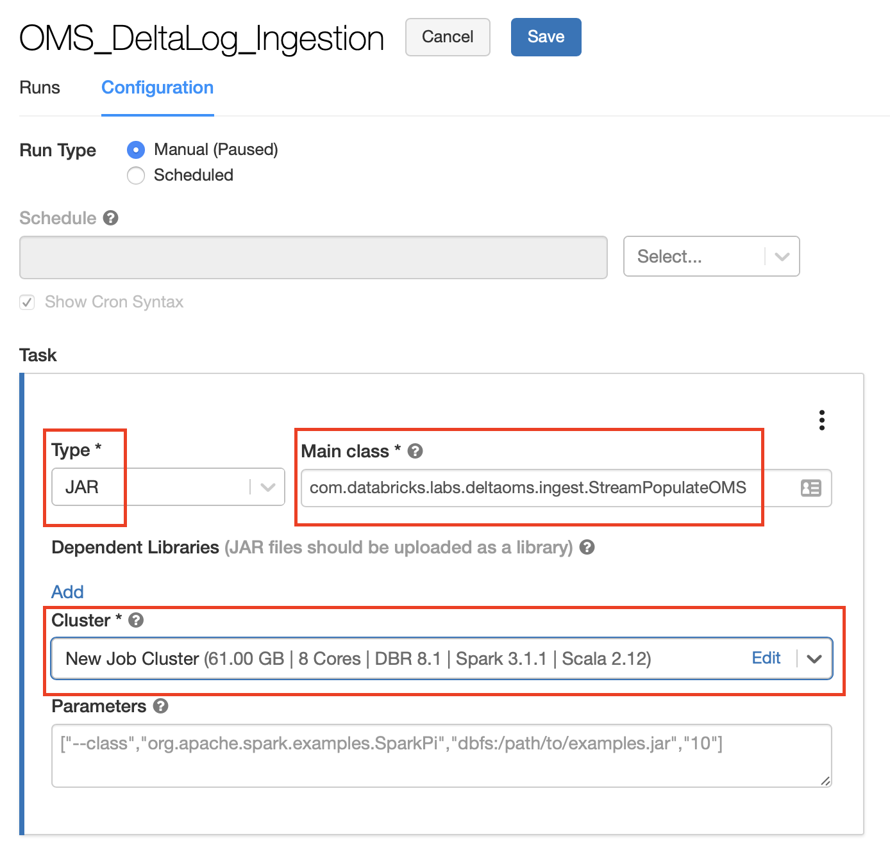
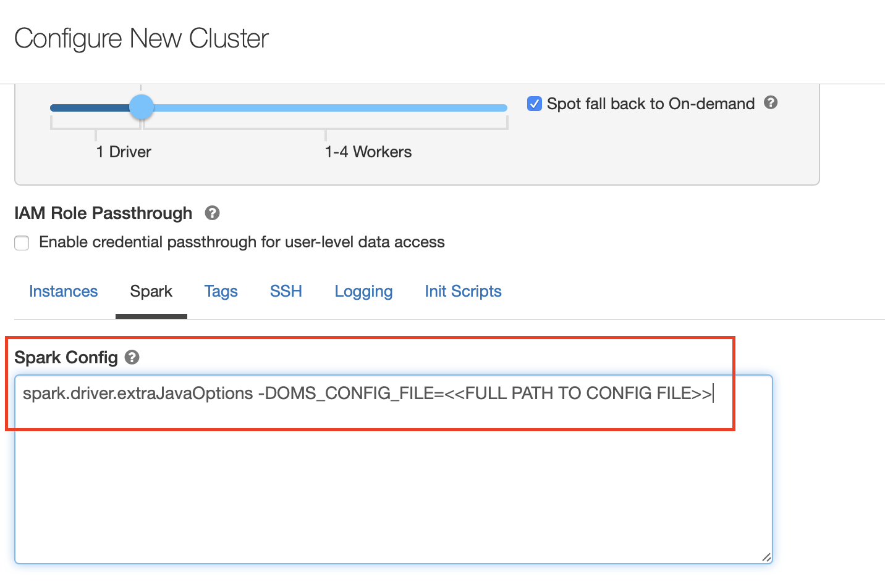
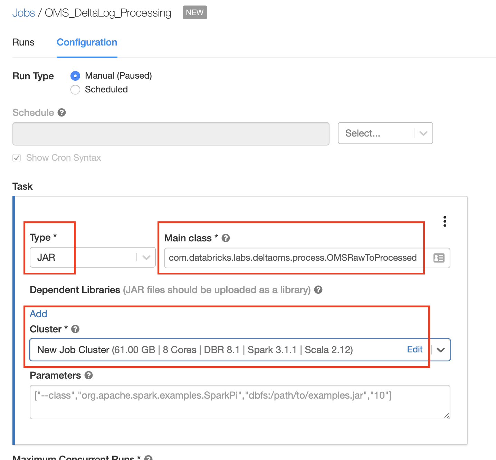

# Delta OMS - Getting Started

The following tutorial will guide you through the process for setting up the Delta Operational 
Metrics Store (OMS) solution on your Databricks Lakehouse environment.

You will deploy / configure the solution, set up a few tables for metrics collection and run some 
sample analysis on the processed data.

### Prerequisites

Make sure you have the following available before proceeding :

- Access to Databricks environment with access to few Delta tables
- Ability to create Databricks job and run them on new cluster
- Proper access permissions to create database, tables and write data to the desired OMS location
- Procure the Delta OMS solution package from your Databricks team (include Delta OMS jar , sample notebooks and documentations)

### Step 1 : Create the Delta OMS Configuration file

Delta OMS solution is configured using a [HOCON](https://github.com/lightbend/config/blob/master/HOCON.md#hocon-human-optimized-config-object-notation) format file. 
The different configuration parameters available are described below : 

| Configuration Key | Description | Required | Example |
| :-----------: | :----------- | ----------- | ----------- |
| base-location      | Base location/path of the OMS Database on the Delta Lake  | Y | dbfs:/spark-warehouse/oms.db |
| db-name   | OMS Database Name. This is the database where all the Delta log details will be collected | Y | oms.db |
| raw-action-table   | OMS table name for storing the raw delta logs collected from the configured tables | Y | raw_actions |
| table-config   | Configuration table name for setting the list of Delta Path and/or tables for which the delta logs should be collected by OMS | Y | table_config |
| path-config-table   | Configuration table name for storing Delta path details and few related metadata for internal processing purposes by OMS | Y | path_config |
| processed-history-table   | Configuration table name for storing processing details for OMS ETL Pipelines. Used internally by OMS | Y | processed_history |
| commit-info-snapshot-table   | Table name for storing the Delta Commit Information generated from the processed raw Delta logs for configured tables/paths | Y | commitinfo_snapshots |
| action-snapshot-table   | Table name for storing the Delta Actions information snapshots. Generated from processing the Raw Delta logs | Y | action_snapshot |
| use-wildcard-path   | Flag to enable/disable processing Delta logs using wildcard patterns extracted from the path configured for OMS solution | N | false (default : true) |
| checkpoint-base   | Base path for the checkpoints for OMS streaming pipeline for collecting the Delta logs for the configured tables | Y | dbfs:/_oms_checkpoints/ |
| checkpoint-suffix   | Suffix to be added to the checkpoint path. Useful during testing for starting off a fresh process | Y | _1234 |
| trigger-interval   | Trigger interval for processing the Delta logs from the configured tables/paths  | N | 30s (default : Once) |
| src-database   | Comma separated list of Source database used for filtering when extracting the Delta table path information from metastore  | N | Sample_db,test_db (default: Blank) |
| table-pattern   | Wildcard filtering of tables to be extracted from the metastore for configuring the Delta OMS solution | N | \*oms* (default: *) |

A sample configuration file :

```
base-location="dbfs:/home/warehouse/oms/"
db-name="oms_sample"
raw-action-table="raw_actions"
table-config="table_config"
path-config-table="path_config"
processed-history-table="processed_history"
commit-info-snapshot-table="commitinfo_snapshots"
action-snapshot-table="action_snapshots"
use-wildcard-path="false"
checkpoint-base="dbfs:/home/oms/_checkpoints"
checkpoint-suffix="_sample_123900"
trigger-interval="once"
```
Use the above information to create a configuration file appropriate to your environment. 
Upload the configuration file to a location on DBFS or your cloud storage. 
**Tip**: You could directly create the configuration file on DBFS from a notebook using 
[dbutils](https://docs.databricks.com/dev-tools/databricks-utils.html) APIs

Note the full path to the configuration file. This will be used in later steps.

### Step 2 : Initialize the OMS Database

This is a **one time** step to initialize the OMS tables in your environment. 
This could be executed from a notebook or as a Databricks job. 
**Note**: This drops and re-creates the entire OMS database, use CAREFULLY.

- Create a cluster with the proper permissions to create databases, tables and write permissions 
to the OMS Base path location. Attach the Databricks Delta OMS jar to the cluster

- Create a Scala notebook on Databricks and execute the following code
```
System.setProperty("OMS_CONFIG_FILE", "<<Full path to the configuration file>>")
val args = Array.empty[String]
com.databricks.labs.deltaoms.ingest.InitializeOMSTables.main(args)
```

Example notebook is also available in the Databricks Delta OMS package.

This will create the OMS Database with the name and base path as per the configuration file. 
It will also create empty table structures for OMS tables.

### Step 3: Configure the monitored database/path/table for Delta OMS solution 

In this step, we will configure the set of databases, tables and/or paths to be monitored for 
tracking the Delta log changes. This can be done in couple of ways:

#### Manually enter databases/tables/path in the config table

Manually enter the locations (database/tables/paths) to be monitored in the table configured through
 `table-config` in the configuration file (Step 1) from a notebook.
 
Example: 
 ```
INSERT INTO <OMS_DB_NAME>.<TABLE_CONFIG_NAME>> VALUES 
       ('<METASTORE_DB_NAME>',false),
       ('<DELTA TABLE LOCATION>',false),
       ('<METASTORE TABLE NAME>', false);
```

#### Automatically configure all tables in the metastore

Configure a Databricks Jar job to read all the Delta tables in the metastore and 
populate the internal Delta OMS config table automatically

On your Databricks environment, navigate to the Jobs UI and create a new Job. Set the following :
- provide a name for the job (example : DeltaOMS_PopulateConfigFromMetastore) 
- select `JAR` as Type of the Task
- provide the main class as `com.databricks.labs.deltaoms.ingest.PopulateMetastoreDeltaTablePaths`
- configure it to run on a new Job cluster
- `Edit` the cluster to pass the OMS Config file path (created in Step 1) using the Spark config 
`spark.driver.extraJavaOptions -DOMS_CONFIG_FILE=<<FULL PATH to the OMS Configuration file>>`
- set up rest of the job as per your environment policies

You can run this job on a schedule to update the config as and when required. 

### Step 4 : Setup Delta Log Ingestion Streaming Job

Next , we will create the Delta OMS Streaming ingestion process on a Databricks environment as a 
[Jar job](https://docs.databricks.com/jobs.html)

On your Databricks environment, navigate to the Jobs UI and create a new Job. Set the following :
- provide a name for the job (example : OMS_DeltaLog_Ingestion) 
- select `JAR` as Type of the Task
- provide the main class as `com.databricks.labs.deltaoms.ingest.StreamPopulateOMS`
- configure it to run on a new Job cluster
- `Edit` the cluster to pass the OMS Config file path (created in Step 1) using the Spark config 
`spark.driver.extraJavaOptions -DOMS_CONFIG_FILE=<<FULL PATH to the OMS Configuration file>>`
- set up rest of the job as per your environment policies

Refer to screenshots below for an example:





Executing this job will start populating the configured `Raw Action` table on Delta OMS. 
**Note** - The execution parameters ( like `checkpoint location` , `trigger interval` etc.) for 
this job is configured through the config file created in Step 1.

### Step 5 : Setup the Delta OMS Raw to Processed Job

This step will configure the job to process the `Raw Delta Log Actions` into a more 
consumable processed table (configured through the config file)

Similar to above, create a new Databricks Jar Job and set the following :

- provide a name for the job (example : OMS_DeltaLog_Processing) 
- select `JAR` as Type of the Task
- provide the main class as `com.databricks.labs.deltaoms.process.OMSRawToProcessed`
- configure it to run on a new Job cluster
- `Edit` the cluster to pass the OMS Config file path (created in Step 1) using the Spark config 
`spark.driver.extraJavaOptions -DOMS_CONFIG_FILE=<<FULL PATH to the OMS Configuration file>>`
- set up rest of the job as per your environment policies

Refer to screenshots below for an example:




This job is a batch job that will be executed on an appropriate schedule.
Executing this job will update the data into the snapshot tables configured through the config file above.

The data is ready to be analyzed once the data is populated into these tables.

### Step 6 : Run some sample analytics on the collected data

Import the sample analysis notebook [Delta OMS Analysis](./notebooks/DeltaOMS_SQL_Analytics.sql) 
into your Databricks environment. Modify the queries to reflect your configuration for 
`OMS DB Name` and other table names.

Executing this notebook will give you an idea on the type of analysis and data structure that can be
utilized as part of the Delta OMS Solution.

You can build on top of this notebook , customize this notebook to your liking and 
create your own Analytics insights and dashboards through Databricks notebooks and/or SQL Analytics.


